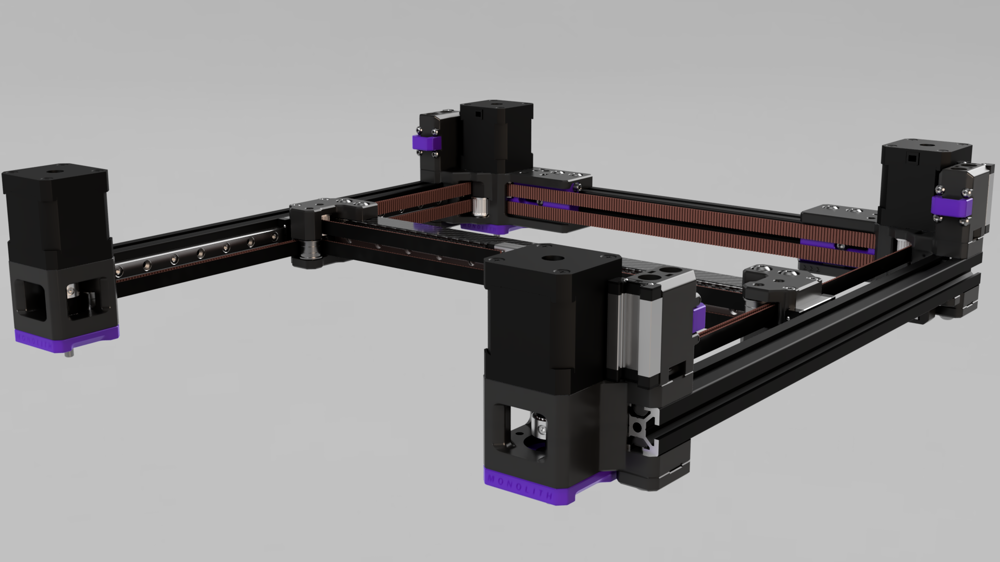
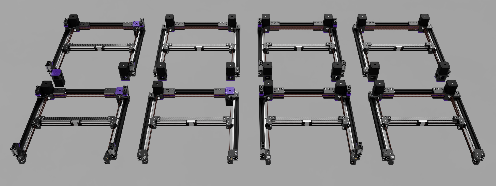

[![CC BY-NC-SA 4.0][cc-by-nc-sa-shield]][cc-by-nc-sa]

# Monolith Gantry [WIP]

## What's this?
This is a performance-oriented, configurable gantry platform for Voron 2.4 and Trident.

**Available drive configurations:**
- 2WD
- 4WD

**Available belt widths:**
- 6mm
- 9mm

**Available X-axis configurations:**
- Front rail (flipped belts, toothed side facing the X extrusion)

## Design goals
- The shortest and the simplest belt path possible without losing full bed capability even with 4WD (toolhead dependant)
- 4WD without increasing belt length and idler count
- Double shear support
- Increased printed part rigidity
- Uncluttered design
- Cheap BOM

## Performance expectations
**2WD:** Due to the 10-15cm shorter belt path, stiffer and lighter XY joints (inside Y rails) your printer should perform similarly to a 50mm smaller one equipped with the same toolhead and X axis setup.

**4WD:** It doesn't come at the cost of adding 20cm extra belt length and more idlers, so input shaper scaling should be close to +100% vs 2WD due to the truly halved effective belt length. IF there are no rigidity bottlekecks elsewhere, which is rarely the case.

## What's the catch?
- You have to space out the front (4WD only) and rear panels on your printer by at least 5mm ([Monolith Panels](https://github.com/CloakedWayne/Monolith_Panels)) or have a 4040 frame.
- The tensioner range is less than half compared to stock. Monolith is not recommended for larger than 350mm build volume.
- There's limited toolhead support currently (Voron compatible toolheads that have loop around belt clips will work).
- Z chain relocation/delete on V2.

## DISCLAIMER: This is a challenging mod and a lot of this stuff needs further testing.

## Printed parts guide
- Recommended print settings: 4 walls, 40% infill (or more), 0.2mm layer height, 0.4mm nozzle
- Recommended material for 6mm versions: **ABS or better**
- Recommended material for 9mm versions: **ABS CF or better**
- **AB** = normal, **CD** = mirrored

### Front rail:
|Drive|Front mounts (2x)|Rear mounts (2x)|Tensioners (2x)|XY joints (L + R)|
|---|---|---|---|---|
|2WD|CD|AB|AB|CD|
|4WD|AB|AB|AB|AB|

### Top rail:
- Right front belt on top: **AB**
- Left front belt on top: **CD**

|Toolhead|Drive|Front mounts (2x)|Rear mounts (2x)|Tensioners (2x)|XY joints (L + R)|
|---|---|---|---|---|---|
|AB|2WD|AB|CD|CD|AB|
|AB|4WD|AB|AB|AB|AB|
|CD|2WD|CD|AB|AB|CD|
|CD|4WD|CD|CD|CD|CD|

    
This work is licensed under a
[Creative Commons Attribution-NonCommercial-ShareAlike 4.0 International License][cc-by-nc-sa].

[![CC BY-NC-SA 4.0][cc-by-nc-sa-image]][cc-by-nc-sa]

[cc-by-nc-sa]: http://creativecommons.org/licenses/by-nc-sa/4.0/
[cc-by-nc-sa-image]: https://licensebuttons.net/l/by-nc-sa/4.0/88x31.png
[cc-by-nc-sa-shield]: https://img.shields.io/badge/License-CC%20BY--NC--SA%204.0-lightgrey.svg
