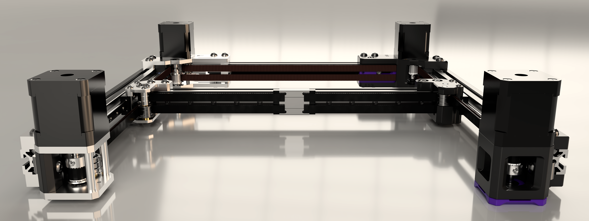

[![CC BY-NC-SA 4.0][cc-by-nc-sa-shield]][cc-by-nc-sa]

# Monolith Gantry R1 Release Candidate 2
> [!IMPORTANT]
> **There is no step-by-step build guide or detailed documentation yet.**
> 
> **The sheet metal version is more difficult to build than what the average Voron user is used to. Please evaluate the required patience and skill levels before proceeding.**

## What's this?
This is a performance-oriented, configurable gantry platform for Voron 2.4 and Trident.

### Drive configurations:
- 2WD
- AWD

### Belt widths:
- 6mm
- 9mm

 ### Materials:
- Printed
- Sheet metal

## What's new with Monolith R1?
- Updated styling
- More shared parts between 6 and 9mm
- Sheet metal options
- Can fit into a stock 2020 frame at the cost of some Y-overtravel with the added no-protrusion mode
- Much better tensioner travel
- No toothed idlers

### [Configurator and BOM - Google Sheets ](https://docs.google.com/spreadsheets/d/14mWAb1CxOuovr1oKOu4pIA4AFW-SMeCLfFVxeun0VMA/edit?usp=sharing)

 

> [!NOTE]
> **If you have questions or want to stay more up-to-date with Monolith, consider joining the dedicated Discord server.**
>
> 
>
> **If you would like to see more of this and other projects in the future, consider supporting me on Ko-fi.**
>
> 

## 2025 Roadmap
- Milled 9mm AWD kits
- Monolith CPAP SLM toolhead
- Better documentation

## Design goals
- The shortest and the simplest belt path possible with AWD compatibility
- The shortest moment arms possible for increased rigidity even when reusing hardware and motion parts
- Double shear steppers and live shaft idlers for higher belt tensions and better reliability
- Good-looking design
- Cheap BOM

## Performance expectations
**2WD:** Due to the 10-15cm shorter belt path, with stiffer and lighter XY-joints the printer should perform similarly to a 50mm smaller one equipped with the same X-axis setup.

**AWD:** It doesn't come at the cost of adding 20cm belt length and idlers, so input shaper scaling can be close to +100% compared to 2WD due to the truly halved effective belt length. But only when no toolhead or frame bottlenecks are limiting its scaling.

**9mm belts:** Wider belts can offer an additional 50% input shaper scaling on top of what's described above.

## What's the catch?
- you have to build a well-balanced system: the increased effective belt stiffness with higher-end gantry configurations will amplify toolhead and frame rigidity issues
- Some toolheads are not yet compatible because of the different belt path
- Z-chain relocation or Z-umbilical is needed on V2
- Trident rear vertical extrusion brackets have to be rotated by 180 degrees or swapped to regular 2020 brackets based on the gantry configuration

## Acknowledgement
I want to thank:

- **ifp, iniqy, krankydonkey, MoneyShot, Nicket, tktktktk, Zakfarias, Scarecrow, The Adeo** for testing and good feedback
- **Sy-Noon** for the awesome logo and feedback on general aesthetics
- **ZaMarin** for FAQ
- **Armchair Heavy Industries** for the exposure and the moderation help I got in their user-project space
- **VoronDesign** for making V2.4 and Trident and for starting me on this journey to improve my FDM design skills
- anyone who helped me along the way

    
This work is licensed under a
[Creative Commons Attribution-NonCommercial-ShareAlike 4.0 International License][cc-by-nc-sa].

[![CC BY-NC-SA 4.0][cc-by-nc-sa-image]][cc-by-nc-sa]

[cc-by-nc-sa]: http://creativecommons.org/licenses/by-nc-sa/4.0/
[cc-by-nc-sa-image]: https://licensebuttons.net/l/by-nc-sa/4.0/88x31.png
[cc-by-nc-sa-shield]: https://img.shields.io/badge/License-CC%20BY--NC--SA%204.0-lightgrey.svg
