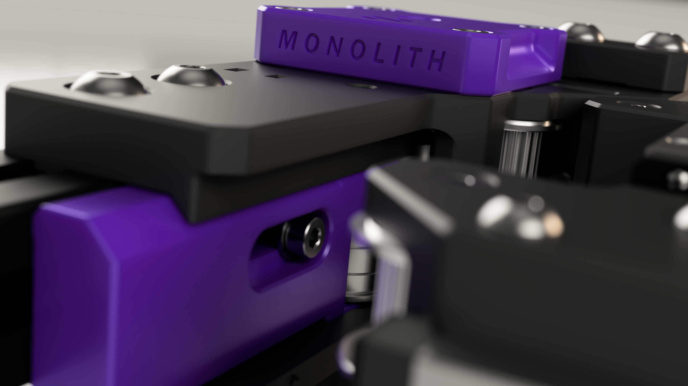
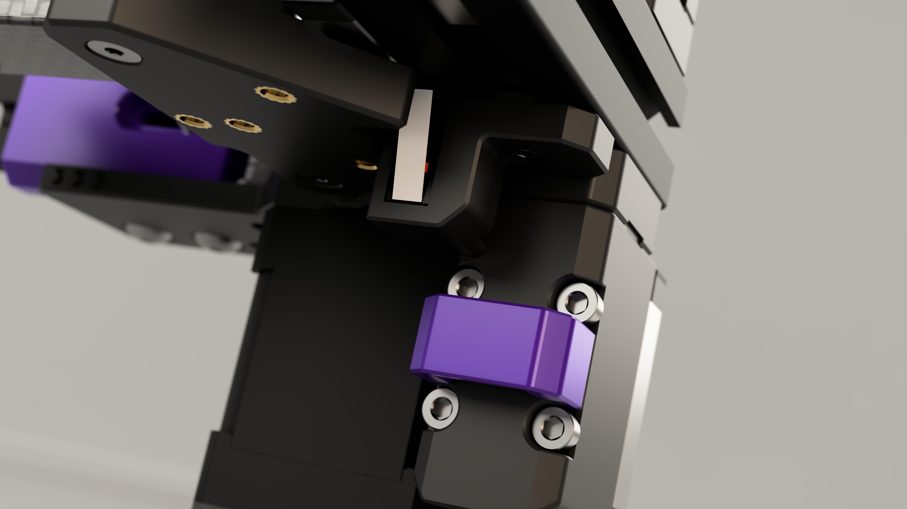

[![CC BY-NC-SA 4.0][cc-by-nc-sa-shield]][cc-by-nc-sa]

# Monolith Gantry [WIP]

## What's this?
This is a performance-oriented, configurable gantry system for Voron 2.4 and Trident.

**Available drive configurations:**
- 2 stepper
- 4 stepper

**Available belt widths:**
- 6mm
- 9mm

**Available X-axis configurations:**
- Front rail (flipped belts, toothed side facing the X extrusion)
- Top rail

## What's the catch?
- You have to space out the front (4 stepper only) and rear panels on your printer by at least 5mm or have a 4040 frame.
- The tensioner range is half compared to stock. I can't recommend this for larger than 350mm builds.
- There's limited toolhead support currently.
- If you want to serialize your printer you have to build it stock first.
- This needs a Z chain relocation on V2.
- Trident top rail configs may need a bed relocation to get to the front of the bed (you can just move the PEI sheet for the same effect).

If you've got any questions you can find me on Discord ***@CloakedWayne***

    
This work is licensed under a
[Creative Commons Attribution-NonCommercial-ShareAlike 4.0 International License][cc-by-nc-sa].

[![CC BY-NC-SA 4.0][cc-by-nc-sa-image]][cc-by-nc-sa]

[cc-by-nc-sa]: http://creativecommons.org/licenses/by-nc-sa/4.0/
[cc-by-nc-sa-image]: https://licensebuttons.net/l/by-nc-sa/4.0/88x31.png
[cc-by-nc-sa-shield]: https://img.shields.io/badge/License-CC%20BY--NC--SA%204.0-lightgrey.svg